# Skills you need to be successfull as an AI Applied Engineer.

keep in mind this idea is base on my own learning journey. I choose to be the best Engineer in the world and that have a price wich am willing to paid by practicing, mastering and teaching everything i learn so you can also learn from me cause i believe knowledge is only useful when you share it with others peoples.

my background: 
- Am a Devsecops expert and i believe understanding an appliying AI in my day-to-day is a great idea to leverage my skills and support others learners.

# Applied AI Engineer

- Make AI ( Machine Learning) (ML)
- Use AI Generative AI (Transformers)

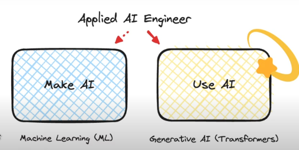

# tradittional approach 

People used to believe that in order to become AI engineer you need to be good at these skills:

(python, tensorflow or python fine-tuneing, cuda, data pipelines, ocr, yolo)

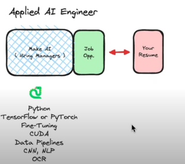

# What you truly do at work?

- javascript
- prompt engineering
- inference platforms
- Evaluations (Unit Tests)
- Cloud Development
- Model capabilities & selection
- Application integration

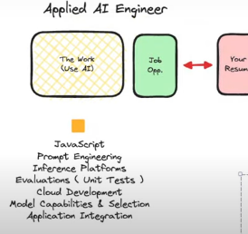

# Compound AI

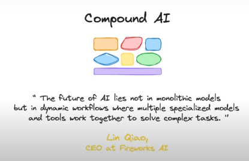

# what to have in mind as a system:

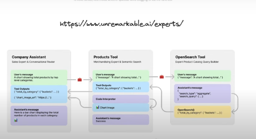

# shared memory and knowledges graph

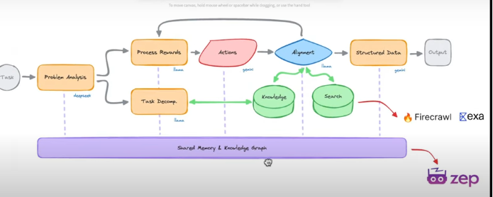

# what we do 

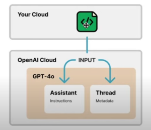

# what is zep?

allow me to use allama model without worry about what is undernit.

# misconception of ai that i discover that made me more confident.

you dont have to be super smart to figure things out, try to follow the path, be consistent and curious but mostly be discipline.

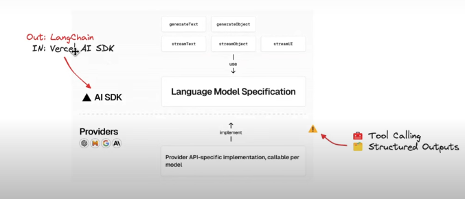

# the two path people usually talking about:

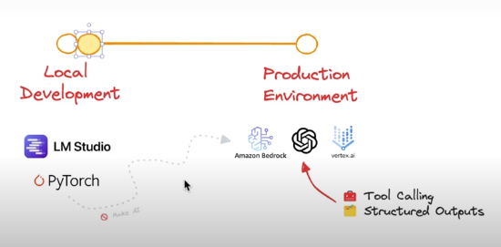

# user facing and operational

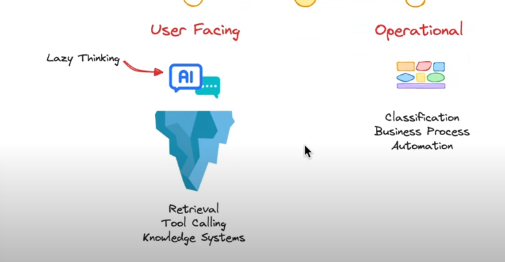

# retrieval

make sure am able to retrive data whatever the tool is and make it relevant.

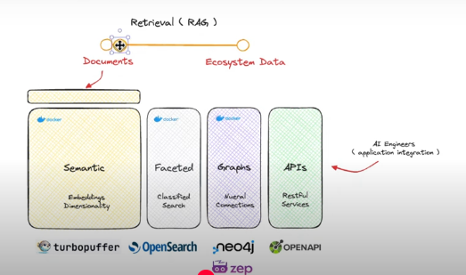

# chain of thought

tell me exactly what i learn from this with reals examples
, conceptualize it.

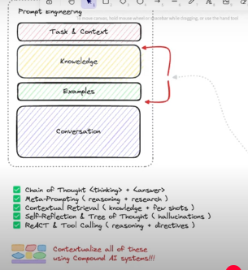

# AI Engineer

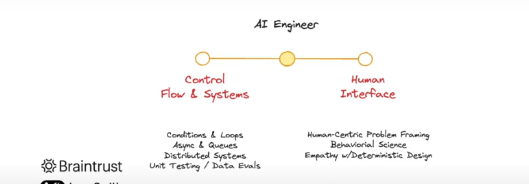

# cloud native

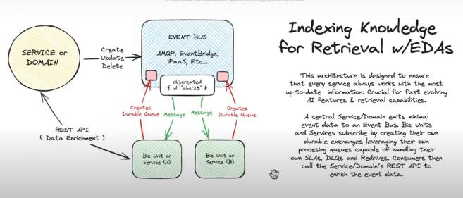

# you're a great ai engineer if you cover al this:

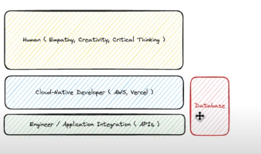

have human empathy, critical thinking, determination, behaviorial science