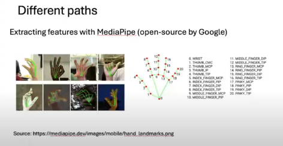
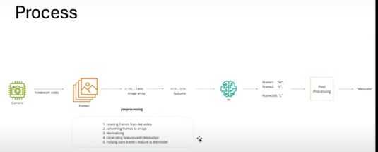

## ASL FINGER SPELLING with Rob koch and Kemalcan

Rob and Kelmacan are trying to solve a problem for those who can speak and can only use their hands to communicate.

## Challenge they faces

They didn't had enough data at first and couldn't have a final conclusion.

## First approach

Extracting feature with MediaPipe (open-source by google)

## Process

