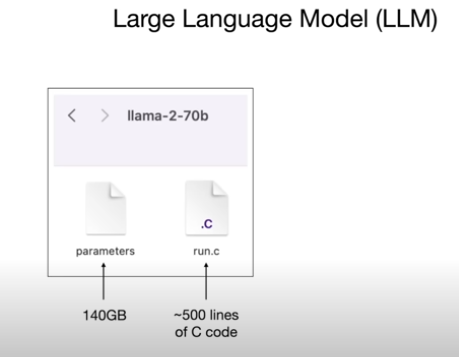

**Day 1 (Mon)**:  
  - Enroll in ExamPro GenAI Bootcamp  
  - Learn LLM fundamentals: tokens, temperature, context windows  
  - Create accounts: OpenAI, HuggingFace, GitHub, AWS/GCP 

## LLM-fundamentals

intro to Large Lnaguage Models with Andrej Kaparthy (AI expert- ai tech lead at tesla)

# What is a Large Lnaguage Model (LLM)?

A llm is just 2 files and this hypothetical directorie.

For example working with a specific example of llama-2-70b ( this a llm release by openAI)

The llma is just 2 files:
-   the parameters
-   the run
