# Data Primer with Kierra

# Agenda:
-   Why Preprocessing Matters?
-   GenAI Misconceptions
-   GenAI Gone Wrong
-   Data Quality
-   Data Preprocessing Best Practices
-   Key Takeaways

# Why Preprocessing Matters for GenAI?

Data preprocessing is the process of transforming raw data into a format that can be efficiently and effectively used for model training.

## Pros:
-   improve Model Accuracy
-   Better Generalization
-   Minimizes Bias

# the quality of the output is directly related to the quality of the input and prompts given

# GenAI Misconceptions

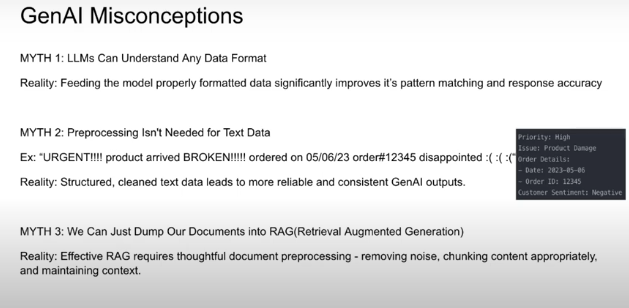

# GenAI Data Gone Wrong

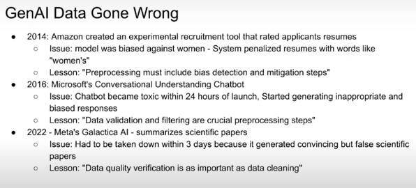

# Data Quality Assessment

High-quality data is the backbone of successful AI inititatives.

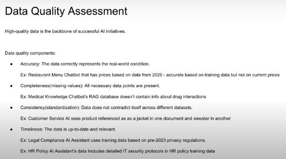

# Data Preparation Best Practices

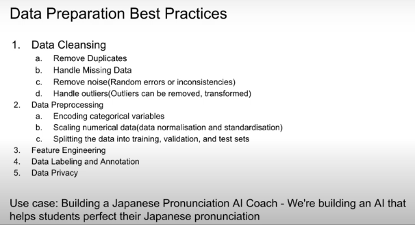

# Data Cleansing - Garbage in, Garbe Out

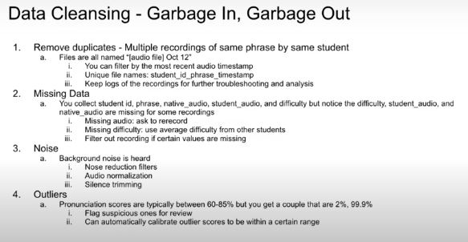

# Data Preprocessing

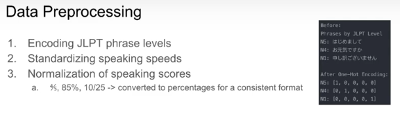

# Data Set Splitting

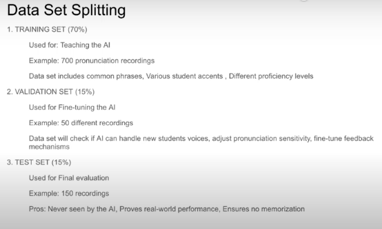

# Feature Engineering

What is feature engineering? think of it as helping the AI notice what humans naturally observe

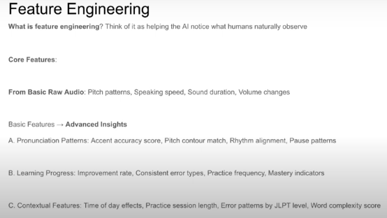

# Data Labeling and Annotation

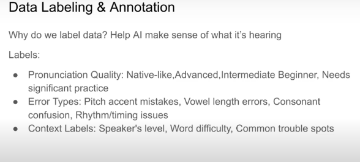

# Data Privacy

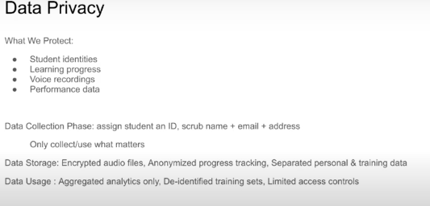

# Key Takeaways

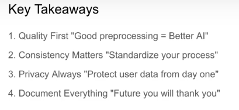