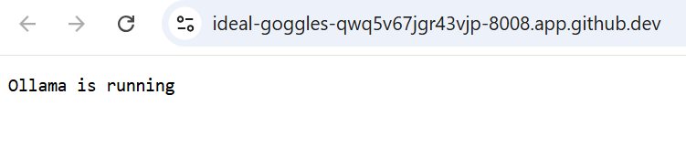
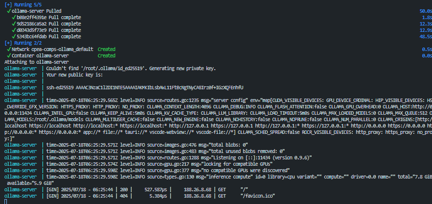
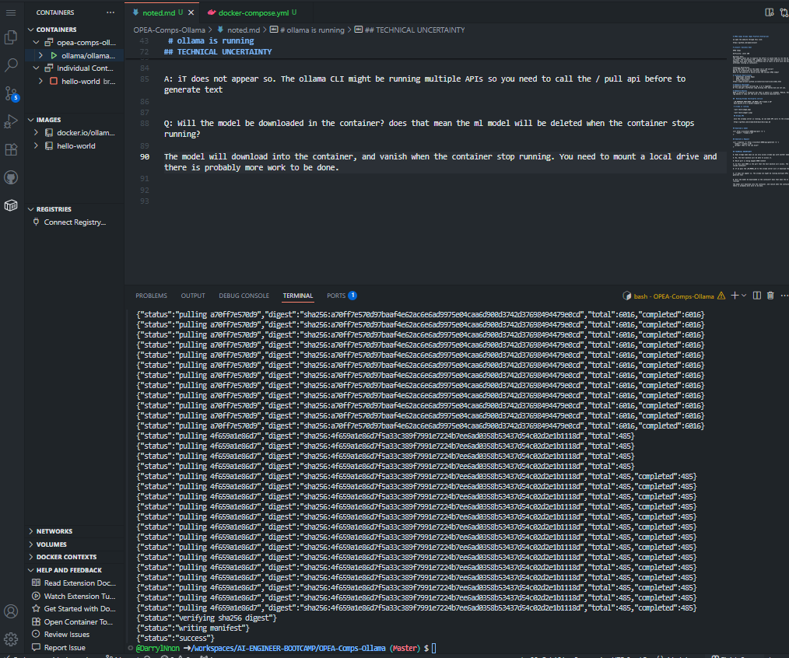
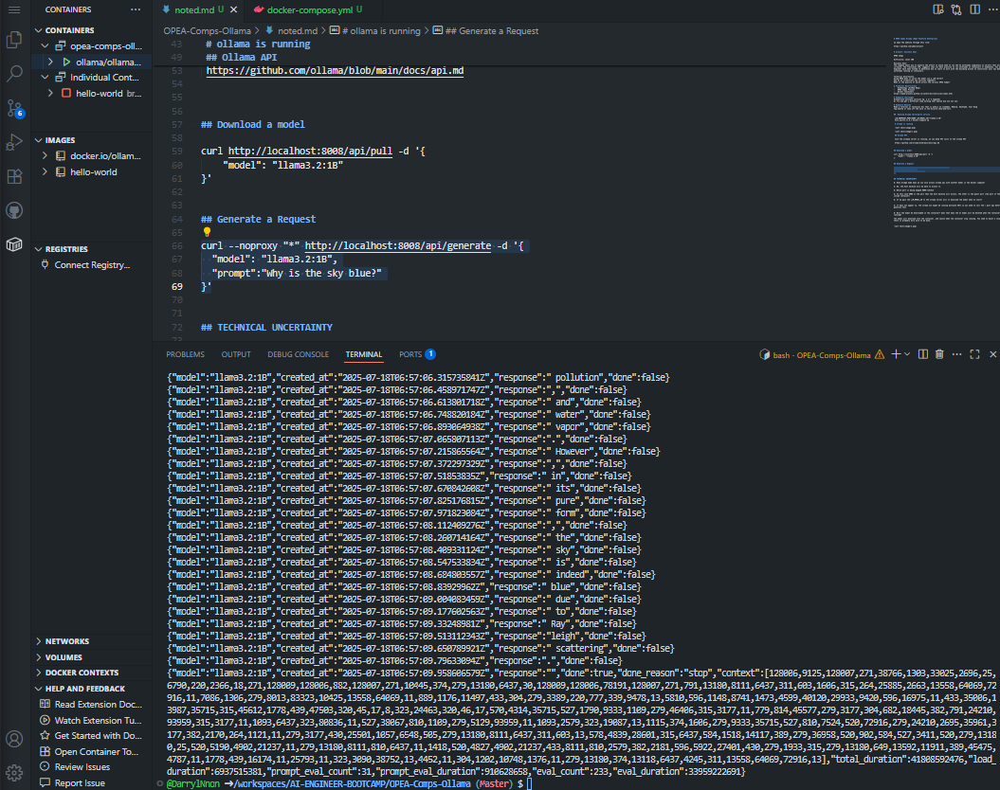

# OPEA Comps Ollama (Open Platform Enterprise)

we open the website through this link:

https://github.com/opea-project

# project: business Goal

OPEA Comps

Difficulty: Level 200

Business Goal:
The company wants you to explore the effort it would take to run the AI workloads completely on servers that will live in-house. The fractional CTO, suggests that its best practice to run workloads in containers or kubenetes. You as the AI Engineer have been tasked to determine how to learn to work with the building blocks to constructor your own GenAI workloads running on containers.

Technical Uncertainty
Using OPEA does it serve the model via a LLM server?
How do we orchestrate two services together?
What is the quality of build across the various OPEA Comps?

# Technical Restrictions
-   GenAIComps (GitHub Repo)
-   OPEA Comps Project
-   Docker Containers
https://opea-project.github.io/latest/microservices/index.html

# Homework Challenges
Orchestrate multiple services eg. 2 or 3 together
Or Try and get a different comp working that Andrew did use not use.

# Homework Bonuses
Make a tutorial or technical doc that is public on LinkedIn, Medium, Hashnode, Your Blog
Tag Andrew or show off the work in the Discord show-and-tell.

##  Running Ollama third-party service 

 LLM_ENDPOINT_PORT=8008 LLM_MODEL_ID="llama3.2:1B"
 host_ip=172.17.0.1 docker-compose up

 # ollama is running

 

 

 ## Ollama API

 once the ollamaa server is running, we can make API calls to the ollama API

 https://github.com/ollama/blob/main/docs/api.md

## Download a model

curl http://localhost:8008/api/pull -d '{
    "model": "llama3.2:1B"
}'

## Generate a Request

curl --noproxy "*" http://localhost:8008/api/generate -d '{
  "model": "llama3.2:1B",
  "prompt":"Why is the sky blue?"
}'

## TECHNICAL UNCERTAINTY

Q: Does bridge mode mean we can only access ollama api with another model in the docker compose?

A: No, the host machine will be able to access it.

Q: Which port is being mapped 8008->141414

A: In this case 8008 is the port that the host machine will access. The other is the guest port (the port of the service inside container)

Q: If we pass the LLM_MODEL_ID to the ollama server will it download the model when on start?

A: iT does not appear so. The ollama CLI might be running multiple APIs so you need to call the / pull api before to generate text

Q: Will the model be downloaded in the container? does that mean the ml model will be deleted when the container stops running?

A: The model will download into the container, and vanish when the container stop running. You need to mount a local drive and there is probably more work to be done.

Q: for the LLM service which can text-generation it suggest it will only work with TGI/VLLM and all you have to do is to have it running. Does TGI and vLLM have a standardize API or is there code to detect which one is running? Do we have to really use Xeon or Guadi processor?

