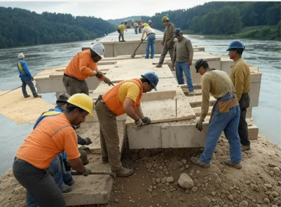
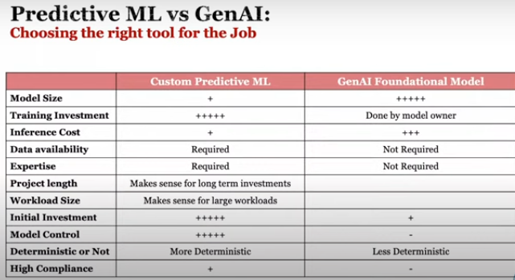

# Preweek - Livestream - Solution Architecting GenAI

In this preweek video, i develop my skills in genai and contribute to the architecture diagram of this bootcamp using lucichart.

I believe, practicing by doing the hard work is making me confident by building project-based learning with Andrew.

life is all about making choice and i choose to make myself valuable now and for the future by understanding, practicing and teaching all the skills that i learn cause i believe life is a teachin process.

# What are we building?

I have been hired as an AI Engineer for a Language learning school to augment the learning experience for student taking instructor-led classes.

I will be doing the following:
    - Augmenting the main web-app to include GenAI functionality
    - Creating a series of projects to act as learning activities for students.

    - Preparing the company to be production-ready with their GenAI Offerings

    - I can use any language i want.

    So because i live in romanian and i already speak french and english as a native i guess my choice is going to be to build this in "romanian language"

# Always remember that we're building the bridge as we cross it.

we will face challenges, struggles, etc.. but we will figure things out.

# Romanian alphabet language that i choose to utilise.

# local hardware

i have a dell "intel core i5 vpro  Dell Latitude 7480 13-Inch Laptop, Core i5-6300U, 8GB RAM, 256GB SSD, Windows 10"

# there is no wrong answer.

I will do my best to make sure i understand and be able to explain everything i learn in simple terms.

# what i will journal?

- hypotesis and technical uncertainty
- technical exploration
- final observations and outcomes

# Rola Dali explanation on the architecting GenAI System diagram

- the first question is 
Predictive ML vs GenAI ( chosing the right tool for the job)

