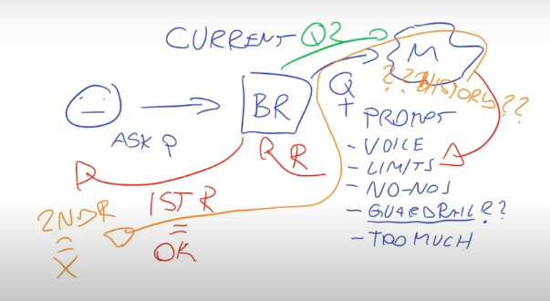
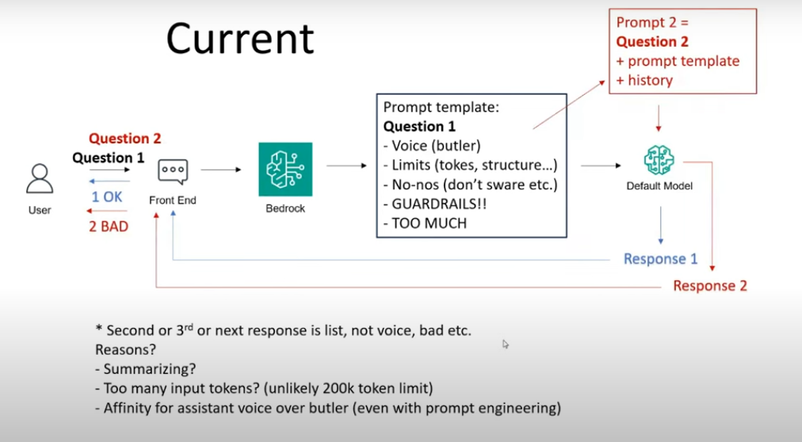
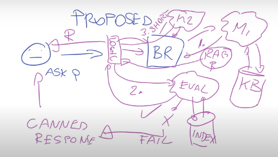
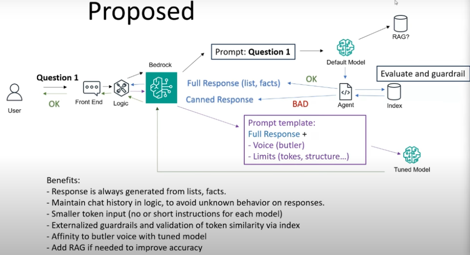

# GenAI solution architecture with Marko (solution architect at AWS)

# SOLUTION BUTLER lIKE Marko call it

to make it more clear this the diagram:

this first napkin of the project implement by aws where marko was acting as SME.

# This is what was propose by Marko

here is the full diagram:

