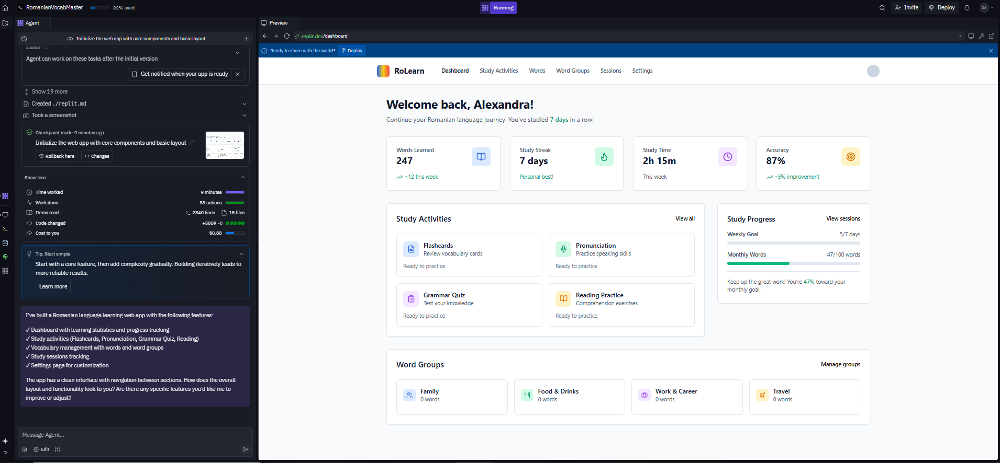

# Frontend prompt

We would like to build a romanian language learning web app.

Role/Profession
Frontend Developer

# project description

We are building a romanian language learning web-app which serves the following purposes:
-   A portal to lauch study activities
-   To store, group and explore romanian vocabulary
-   To review study progress

# The web-app intended for desktop only, so we don't have to be concerned with mobile layouts.

# Technical requirements:

-   react.js as the frontend library
-   Tailwind CSS as the framework
-   Vite.js as the local development server
-   Typescript for the programming language
-   ShadCN for components

# Frontend Routes
This is a list of routes for our web-app we are building.
Each of these routes are page and we'll describe them in more details un der the pages heading.

/dashboard
/study-activities
/study-activities/:id
/words
/words/:id
/groups
/groups/:id
/sessions
/settings

The default route / should forward to /dashboard

Global Components
Navigation

There will be a horizontal navigation bar with the following links:
-   Dashboard
-   Study Activities
-   Words
-   Word Groups
-   Sessions
-   Settings

# here is the result using replit.com

I also add a short video link of the implementation on replit:

<video controls src="frontend live.mp4" title="Title"></video>