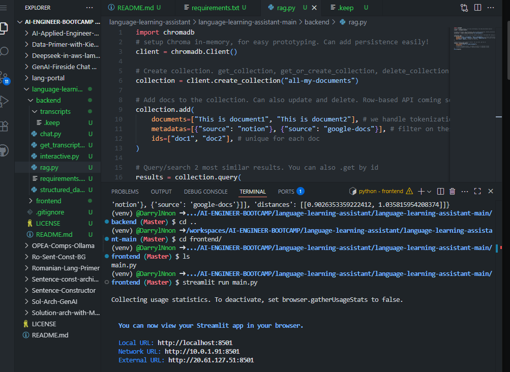
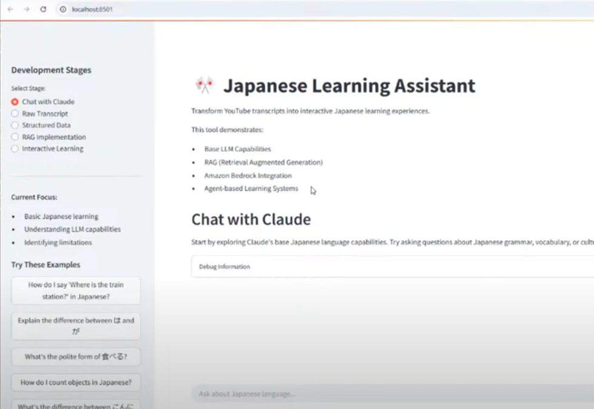
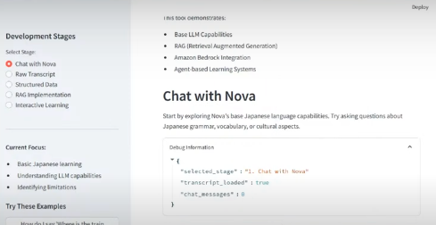

# business goal week 2

Listening Learning App

Difficulty: Level 300

Business Goal: 
You are an Applied AI Engineer and you have been tasked to build a Language Listening Comprehension App. There are practice listening comprehension examples for language learning tests on youtube.

Pull the youtube content, and use that to generate out similar style listening comprehension.

Technical Uncertainty:
Don’t know Japanese!
Accessing or storing documents as vector store with Sqlite3
TSS might not exist for my target language OR might not be good enough.
ASR might not exist for my target language OR might not be good enough.
Can you pull transcripts for the target videos?

Technical Requirements:
(Optional) Speech to Text, (ASR) Transcribe. eg Amazon Transcribe. OpenWhisper
Youtube Transcript API (Download Transcript from Youtube)
LLM + Tool Use “Agent”
Sqlite3 - Knowledge Base 
Text to Speech (TTS) eg. Amazon Polly
AI Coding Assistant eg. Amazon Developer Q, Windsurf, Cursor, Github Copilot
Frontend eg. Streamlit.
Guardrails


# language-learning-assistant

**Difficulty:** Level 200 *(Due to RAG implementation and multiple AWS services integration)*

**Business Goal:**
A progressive learning tool that demonstrates how RAG and agents can enhance language learning by grounding responses in real Japanese lesson content. The system shows the evolution from basic LLM responses to a fully contextual learning assistant, helping students understand both the technical implementation and practical benefits of RAG.

**Technical Uncertainty:**
1. How effectively can we process and structure bilingual (Japanese/English) content for RAG?
2. What's the optimal way to chunk and embed Japanese language content?
3. How can we effectively demonstrate the progression from base LLM to RAG to students?
4. Can we maintain context accuracy when retrieving Japanese language examples?
5. How do we balance between giving direct answers and providing learning guidance?
6. What's the most effective way to structure multiple-choice questions from retrieved content?

**Technical Restrictions:**
* Must use Amazon Bedrock for:
   * API (converse, guardrails, embeddings, agents) (https://boto3.amazonaws.com/v1/documentation/api/latest/index.html)
     * Aamzon Nova Micro for text generation (https://aws.amazon.com/ai/generative-ai/nova)
   * Titan for embeddings
* Must implement in Streamlit, pandas (data visualization)
* Must use SQLite for vector storage
* Must handle YouTube transcripts as knowledge source (YouTubeTranscriptApi: https://pypi.org/project/youtube-transcript-api/)
* Must demonstrate clear progression through stages:
   * Base LLM
   * Raw transcript
   * Structured data
   * RAG implementation
   * Interactive features
* Must maintain clear separation between components for teaching purposes
* Must include proper error handling for Japanese text processing
* Must provide clear visualization of RAG process
* Should work within free tier limits where possible

This structure:
1. Sets clear expectations
2. Highlights key technical challenges
3. Defines specific constraints
4. Keeps focus on both learning outcomes and technical implementation


## knowledge

chroma github link repo: https://github.com/chroma-core/chroma

```sh
pip install


```sh
streamlit run main.py
```



# language portal



