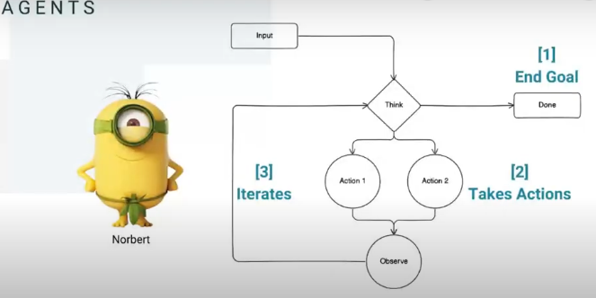

# Agents with George and Derek

What is an Agent?

you can say something is an agent when it can do 3 things:

-   it has to have a goal (either is hungry or trying to obey something)

-   they can't take action that affect external world or do anything that affect negatively the world

-   it keep iterating untill it reach the goal

