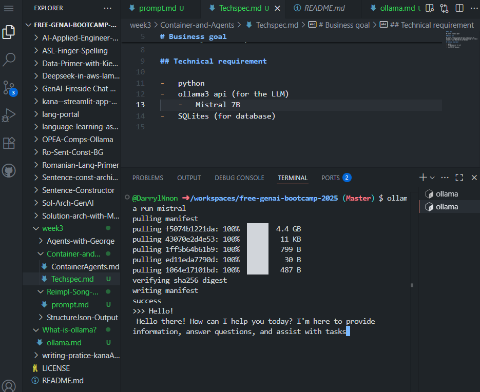

# Tech Spec

We want to create an Agent

# Business goal

We want to create a program that will find lyric of the internet for a target song in a specific language and produce vocabulary to be imported into our database

## Technical requirement

-   python
-   ollama3 api (for the LLM)
    -   Mistral 7B
-   SQLites (for database)
-   duckduckgo-search (to search for lyrics)

# Implementation Details

### Getlyric/api/get_lyrics 

- this endpoint takes a song name and optionally maybe the artist and return the lyric in text format.

### Request parameter
-   `song_name` (str): (required) the name of the song
-   `artist_name` (str): (optional) the name of the artist

### Json Response

-   `lyrics` (str): The lyric of the song

### Getvocabulary/api/get_lyrics 

- this endpoint takes a file or a song and return a list of vocabulary words found in the lyrics in a specific json format

### tools available

-   tools/extract_vocabulary.py
-   tools/get_page_content.py
-   tools/search_web.py
