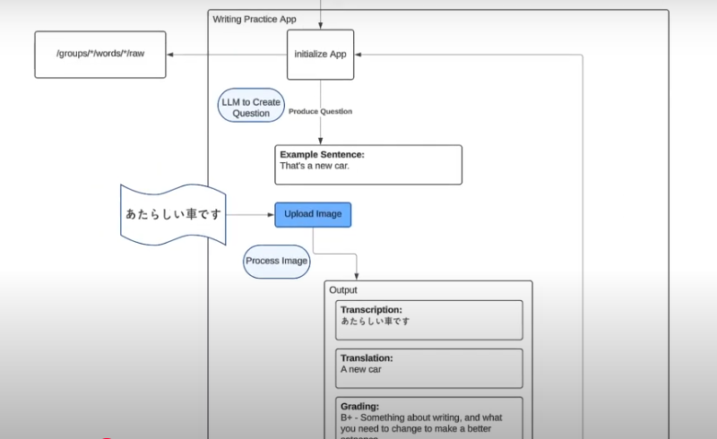
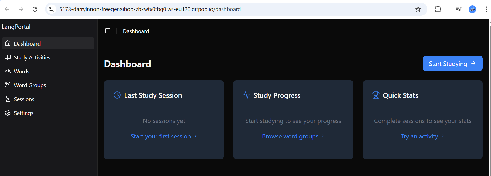

# Writing Practice

Difficulty: Level 200

# Business Goal: 
Students have asked if there could be a learning exercise to practice writing language sentences.
You have been tasked to build a prototyping application which will take a word group, and generate very simple sentences in english, and you must write them in the target lanagueg eg. Japanese.

# Tech spec

## Initialization
When the app first initializes it needs to do thefollowing:
-   fetch  from the GET localhost:5000/api/groups/:id/raw this will return a collection of words in json structure. It will have japanese words with their english translation. We need to sore these words in memory

## Page States

Page state represent the stat of the single page application should behave from a user's perspective

## Setup
The user will then see a button to generate sentence when they press this button, the app will choose a word at random and using an LLM it will construct a simple sentence using JLTPN5 grammar. It should only use words within the group or just the single target word.

Imagine we have the following words: Car, Book, New

## Practice State

When the user is in practice state.
they will see an english sentence,
they will also see an upload field under the english sentence
they will see the button called "submit for review"
when they press the submit for review button an upload image will be passed to the grading system. The grading system will do the following information:
    - Transcription of image
    - translation of transcription
    - grading
        - a letter scorre using the 5 rank to score
        - a description of whether the attempt was accurate to the english sentence and suggestion

## Sentence generator LLM prompt:

Generate a sentence using the following word: {(word)}
the grammar should be scoped to JLPTN5 grammar.
You can use the following vocabulary to construct a simple sentence:

-   Simppe object eg: book, car, ramen, sushi
-   simple verbs, to drink, to eat to meet
-   simple times eg: tommorrow, today, yesterday

# Technical Requirements:

-   Streamlit
-   MangaOCR (Japanese) or for another language use   Managed LLM that has Vision eg. GPT4o
-   Be able to upload an image

# write-practice diagram

## grading system

The grading system will do the following:
    it will transcribe the image using MangoOCR
    it will use an LLM to produce a litteral translation of the transcription
    it will use use another LLM to produce a grade
    it will then return this data to the frontend app

## lang-portal open port:
- port 5000 the backend
- port 5173 the frontend

